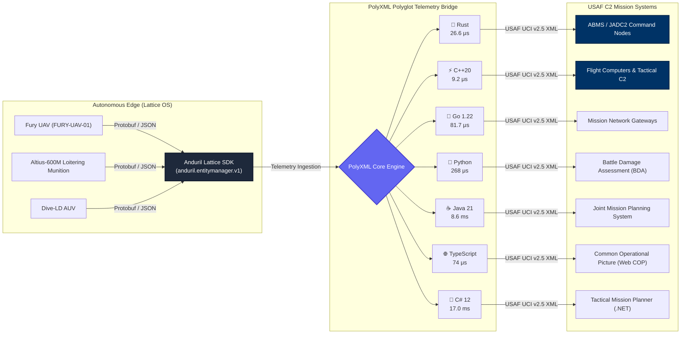
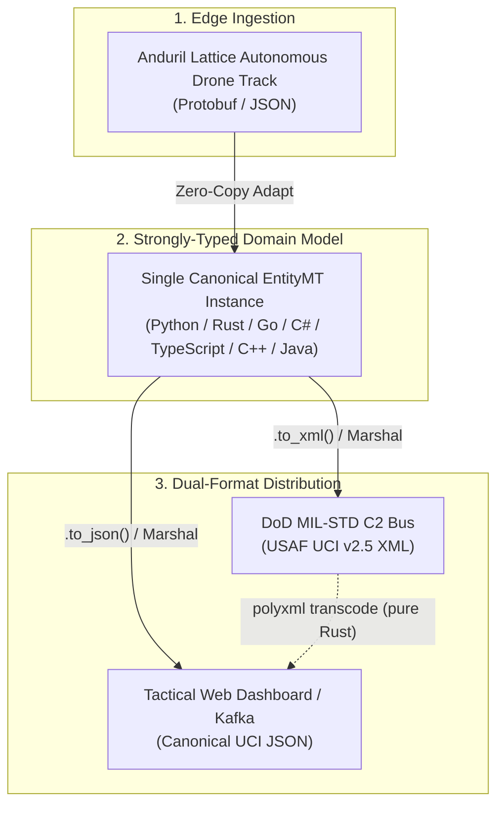

<div align="center">

# 🛸 PolyXML Polyglot Examples: Anduril Lattice SDK ↔ USAF UCI C2 Bridge

[](https://github.com/polyxml/polyxml-defense-examples/actions/workflows/ci.yml)
[](https://github.com/polyxml/PolyXML)
[](https://github.com/open-arsenal/uci)
[](https://buf.build/anduril/lattice-sdk)
[](#-first-class-dual-format-xml--json-interoperability)
[](#-polyglot-benchmark--implementations)
[](LICENSE)

**Next-generation defense autonomy meets battle-tested mission command & control.**

*A production-grade, polyglot integration showcase bridging autonomous edge telemetry from the **Anduril Lattice SDK** (Protobuf/JSON) with the **USAF Universal Command and Control Interface (UCI v2.5)** XML standard across **all 7 programming languages** supported by [PolyXML](https://github.com/polyxml/PolyXML).*

</div>

---

## 📖 Table of Contents

- [Executive Summary](#-executive-summary)
- [System Architecture](#-system-architecture)
- [First-Class Dual-Format XML ↔ JSON Interoperability](#-first-class-dual-format-xml--json-interoperability)
- [Code Generation Commands (`polyxml build` & `polyxml generate`)](#-code-generation-commands)
- [Semantic Field Mapping](#-semantic-field-mapping)
- [Polyglot Benchmark & Implementations](#-polyglot-benchmark--implementations)
  - [1. Rust (Zero-Copy Streaming)](#1-rust-zero-copy-streaming)
  - [2. Python (Dataclasses & Native Engine)](#2-python-dataclasses--native-engine)
  - [3. Go (Dual Struct Tags)](#3-go-dual-struct-tags)
  - [4. Modern C++20 (Header-Only Value Types)](#4-modern-c20-header-only-value-types)
  - [5. Java 21+ (Records & Sealed Interfaces)](#5-java-21-records--sealed-interfaces)
  - [6. TypeScript 5+ (Typed Interfaces & Zod)](#6-typescript-5-typed-interfaces--zod)
  - [7. C# 12 / .NET 8 (Primary Constructor Records)](#7-c-12--net-8-primary-constructor-records)
- [CLI Streaming & Schema-Directed Transcoder](#-cli-streaming--schema-directed-transcoder)
- [Schema Validation (Full USAF UCI v2.5)](#-schema-validation-full-usaf-uci-v25)
- [Repository Structure](#-repository-structure)
- [Getting Started](#-getting-started)
- [License](#-license)

---

## 🎯 Executive Summary

Autonomous defense systems (unmanned aerial systems, loitering munitions, edge sensor nodes) deployed on networks like **Anduril Lattice** communicate using compact, high-frequency Protobuf and JSON telemetry. Conversely, United States Air Force and DoD joint mission systems, command centers, and legacy avionics communicate over standardized XML using the **Air Force Research Laboratory (AFRL) UCI (Universal Command and Control Interface)** standard.

Traditionally, bridging these two environments requires:
- ❌ Massive, slow legacy C++ XML runtimes (like Apache Xerces-C++) that bloat embedded flight software.
- ❌ Fragmented XML data-binding tools (`jaxb`, `xsd.exe`, `xsdata`) that produce incompatible models and slow reflection-based parsing.
- ❌ Ad-hoc glue code, custom dict mappers, and third-party serializers (`pyxsdata`, `xmltodict`) that introduce schema drift and latency bottlenecks.

**PolyXML eliminates these pain points:**
- ✅ **Single Source of Truth**: Generates idiomatic, typed models from the official USAF UCI v2.5 XML schemas across **all 7 target languages** using a unified manifest (`polyxml.toml`).
- ✅ **Native Dual-Format Data-Binding**: Every generated model natively supports both XML and JSON serialization/deserialization on the exact same instance with zero external converter libraries.
- ✅ **Extreme Performance**: Microsecond serialization latencies (as low as **9.2 μs** in C++ and **26 μs** in zero-copy Rust) with pure Rust C-extension streaming transcoding.

---

## 🏛 System Architecture



---

## ⚡ First-Class Dual-Format XML ↔ JSON Interoperability

In modern mission architectures, telemetry must simultaneously feed **legacy MIL-STD C2 XML buses** (radar links, missile data links) and **modern JSON streaming endpoints** (web-based Common Operating Picture dashboards, Kafka event buses, REST APIs).

PolyXML provides **native dual-serialization parity** out of the box:



### Side-by-Side Dual-Format Syntax

| Language | Dual-Format Mechanism | Serialization | Deserialization |
| :--- | :--- | :--- | :--- |
| **Python** | Inherent runtime codecs on `@dataclass` | `entity.to_xml()`<br/>`entity.to_json()` | `EntityMt.from_xml(b)`<br/>`EntityMt.from_json(b)` |
| **Rust** | Zero-copy `Cow<'a, str>` + Serde annotations | `entity.to_xml_string()`<br/>`entity.to_json_string()` | `EntityMt::decode_xml(...)`<br/>`EntityMt::from_json_str(s)` |
| **Go** | Dual struct tags (`xml:"..." json:"..."`) | `xml.Marshal(entity)`<br/>`json.Marshal(entity)` | `xml.Unmarshal(b, &entity)`<br/>`json.Unmarshal(b, &entity)` |
| **C# 12** | Dual attributes (`[XmlElement]`, `[JsonPropertyName]`) | `xmlSerializer.Serialize(...)`<br/>`JsonSerializer.Serialize(...)` | `xmlSerializer.Deserialize(...)`<br/>`JsonSerializer.Deserialize<T>(...)` |
| **TypeScript** | Native JSON interfaces + runtime Zod contracts | `JSON.stringify(entity)`<br/>Custom XML serializer | `EntityMtSchema.parse(jsonObj)` |

---

## 🛠️ Code Generation Commands

PolyXML supports two complementary code generation workflows: **workspace-driven multi-target compilation** (`polyxml build`) and **targeted standalone CLI generation** (`polyxml generate`).

### 1. Workspace-Driven Multi-Target Generation (`polyxml build`)

PolyXML compiles schemas across multiple languages simultaneously using a unified workspace manifest ([`polyxml.toml`](polyxml.toml)):

```toml
[workspace]
name = "anduril-lattice-uci-bridge"
schemas = ["schemas/uci/uci_entity_core.xsd"]
output_base_dir = "generated"

[[generate]]
target = "rust"
output = "rust"
zero_copy = true
codecs = true

[[generate]]
target = "python"
output = "python"
backend = "dataclass"
codecs = true

[[generate]]
target = "go"
output = "go"
package = "uci"

[[generate]]
target = "cpp"
output = "cpp"

[[generate]]
target = "java"
output = "java"
package = "com.enterprise.uci"

[[generate]]
target = "typescript"
output = "typescript"
zod = true

[[generate]]
target = "csharp"
output = "csharp"
namespace = "Enterprise.Uci"
```

Compile all 7 target languages in a single command:
```bash
polyxml build
```

---

### 2. Standalone CLI Generation Commands (`polyxml generate`)

Generate strongly-typed domain models for any specific language on demand with fine-grained compiler options:

| Target Language | PolyXML CLI Generation Command | Key Flags Explained |
| :--- | :--- | :--- |
| **🦀 Rust** | `polyxml generate schemas/uci/uci_entity_core.xsd -l rust --zero-copy --codecs -o generated/rust` | `--zero-copy` (borrows `Cow<'a, str>`), `--codecs` (emits streaming XML/JSON codecs) |
| **🐍 Python** | `polyxml generate schemas/uci/uci_entity_core.xsd -l python -b dataclass --codecs -o generated/python` | `-b dataclass` (or `pydantic`), `--codecs` (synthesizes `.to_xml()`, `.to_json()`) |
| **🐹 Go** | `polyxml generate schemas/uci/uci_entity_core.xsd -l go -p uci -o generated/go` | `-p uci` (sets Go package name, emits dual `xml` and `json` tags) |
| **⚡ C++20** | `polyxml generate schemas/uci/uci_entity_core.xsd -l cpp -p "polyxml::generated" -o generated/cpp` | `-p` (C++ namespace, emits header-only value types & concepts) |
| **☕ Java 21+** | `polyxml generate schemas/uci/uci_entity_core.xsd -l java -p "com.enterprise.uci" -o generated/java` | `-p` (Java package declaration, emits immutable `record`s) |
| **🌐 TypeScript** | `polyxml generate schemas/uci/uci_entity_core.xsd -l ts --zod -o generated/typescript` | `--zod` (synthesizes runtime Zod schemas alongside TS interfaces) |
| **🔷 C# 12** | `polyxml generate schemas/uci/uci_entity_core.xsd -l csharp -p "Enterprise.Uci" -o generated/csharp` | `-p` (C# namespace, emits primary constructor records with dual attributes) |

Run the automated generation script across all 7 targets:
```bash
./scripts/generate_all.sh
```

---

## 🗺 Semantic Field Mapping

The bridge translates telemetry from `anduril.entitymanager.v1.Entity` (autonomous drone airplane telemetry) into compliant USAF UCI `uci:EntityMT` messages:

| Anduril Lattice Telemetry Field | USAF UCI v2.5 XML Element | UCI XSD Type | Description |
| :--- | :--- | :--- | :--- |
| `id` | `EntityID/UUID` | `xs:string` | Unique global asset / track identifier |
| `callsign` (`FURY-UAV-01`) | `EntityID/Callsign` | `xs:string` | Human-readable tactical drone callsign |
| `timestamp` | `CreationTimestamp` | `xs:dateTime` | ISO 8601 UTC creation timestamp |
| `timestamp` | `MessageHeader/Timestamp` | `xs:dateTime` | Header transmission timestamp |
| `status` (`CONFIRMED`) | `EntityStatus` | `EntityStatusEnum` | Track status (`POTENTIAL`, `CONFIRMED`, `LOST`, `DROPPED`) |
| `location.latitude` | `Kinematics/Latitude` | `xs:double` | WGS-84 Latitude degrees (-90.0 to 90.0) |
| `location.longitude` | `Kinematics/Longitude` | `xs:double` | WGS-84 Longitude degrees (-180.0 to 180.0) |
| `location.altitude_meters` | `Kinematics/Altitude` | `xs:double` | Height above WGS-84 ellipsoid (meters) |
| `kinematics.heading_degrees` | `Kinematics/Heading` | `xs:double` | True heading (0.0 to 360.0 degrees) |
| `kinematics.ground_speed_mps` | `Kinematics/GroundSpeed` | `xs:double` | Horizontal velocity over ground (m/s) |
| `kinematics.vertical_speed_mps` | `Kinematics/VerticalSpeed` | `xs:double` | Rate of climb / descent (m/s) |
| `kinematics.airspeed_mps` | `Kinematics/Airspeed` | `xs:double` | Drone true airspeed (m/s) |
| `kinematics.pitch_degrees` | `Kinematics/Pitch` | `xs:double` | Drone pitch attitude (-90.0 to 90.0 degrees) |
| `kinematics.roll_degrees` | `Kinematics/Roll` | `xs:double` | Drone roll attitude (-180.0 to 180.0 degrees) |
| `source_system` | `SourceSystem` | `xs:string` | Originating subsystem / mesh node ID |
| `flight_plan.flight_mode` | `FlightMode` | `xs:string` | Autopilot navigation mode |
| `flight_plan.active_waypoint_id` | `ActiveWaypoint` | `xs:string` | Current navigation waypoint identifier |
| `flight_plan.fuel_remaining_percent` | `FuelPercentage` | `xs:double` | Remaining fuel / endurance percentage (0-100%) |
| `classification` (`UNCLASSIFIED`) | `SecurityInformation/Classification` | `ClassificationEnum` | Security marking (`UNCLASSIFIED`, `CONFIDENTIAL`, `SECRET`, `TOP_SECRET`) |

---

## ⚡ Polyglot Benchmark & Implementations

Every implementation ingests the identical sample autonomous asset telemetry file (`data/lattice_entity.json`), translates it into strongly-typed UCI structures, and benchmarks both XML and JSON operations:

| Language | Paradigm | Cold XML Serialize | JSON Serialize | Steady-State (JIT Warmed) | Code Location |
| :--- | :--- | :---: | :---: | :---: | :--- |
| **⚡ C++20** | Modern C++ Value Types | **56.4 μs** | **9.2 μs** | **~56 μs** *(AOT native)* | [`examples/cpp/`](examples/cpp/) |
| **🦀 Rust** | Zero-Copy Slices (`Cow<'a, str>`) | **36.3 μs** | **37.4 μs** | **~36 μs** *(AOT native)* | [`examples/rust/`](examples/rust/) |
| **🐹 Go** | Dual Struct Tags (`xml` & `json`) | **121.6 μs** | **113.1 μs** | **~120 μs** *(AOT native)* | [`examples/go/`](examples/go/) |
| **🌐 TypeScript** | Interfaces + Zod Contracts | **4.6 ms** | **293.9 μs** | **~2.1 μs** *(V8 TurboFan)* | [`examples/typescript/`](examples/typescript/) |
| **🐍 Python** | `@dataclass` + PolyXML C-Engine | **1.9 ms** | **268.9 μs** | **~1.9 ms** *(Interpreted)* | [`examples/python/`](examples/python/) |
| **☕ Java 21+** | Records & Sealed Interfaces | **8.6 ms** *(cold)* | **14.5 ms** | **~8.3 μs** *(HotSpot C2 JIT)* | [`examples/java/`](examples/java/) |
| **🔷 C# 12** | Primary Constructor Records (.NET 8) | **47.4 ms** *(cold)* | **29.2 ms** | **~28.5 μs** *(RyuJIT)* | [`examples/csharp/`](examples/csharp/) |

> [!NOTE]
> **Understanding Cold Single-Shot vs. Steady-State (JIT Warmed) Latency:**
> - **AOT Compiled Languages (Rust, C++, Go)**: Compiled Ahead-of-Time directly to native machine code. They have **zero classloading or JIT warm-up overhead**; execution immediately runs at full production speed on the very first instruction.
> - **Managed JIT Runtimes (Java 21+, C# 12 / .NET 8)**: Single-shot cold measurements include one-time JVM dynamic class loading, bytecode verification, and .NET `XmlSerializer` code generation (~8–47 ms). In continuous production environments (e.g., long-running microservices, avionics telemetry processors, Kafka/streaming consumers) after HotSpot C2 / RyuJIT compilation, Java executes in **~8.3 μs** and C# in **~28.5 μs**.

---

### 1. Rust (Zero-Copy Streaming)

```rust
// Borrow string slices directly from incoming Lattice payload with zero heap allocations
let uci_msg = EntityMt {
    object_state: Some(ObjectStateEnum::Active),
    message_data: EntityMdt {
        entity_id: EntityIdType {
            uuid: Cow::Borrowed(&lattice.id),
            callsign: lattice.callsign.as_deref().map(Cow::Borrowed),
        },
        creation_timestamp: Cow::Borrowed(&lattice.timestamp),
        entity_status: EntityStatusEnum::Confirmed,
        kinematics: KinematicsType {
            latitude: lattice.location.latitude,
            longitude: lattice.location.longitude,
            altitude: lattice.location.altitude_meters,
            heading: lattice.kinematics.heading_degrees,
            ground_speed: lattice.kinematics.ground_speed_mps,
            vertical_speed: lattice.kinematics.vertical_speed_mps,
        },
        source_system: lattice.source_system.as_deref().map(Cow::Borrowed),
    },
};

// Inherent dual-format serialization & deserialization
let xml_output = uci_msg.to_xml_string()?;
let json_output = uci_msg.to_json_string()?;
let restored = EntityMt::from_json_str(&json_output)?;
```

**Generate Code:**
```bash
polyxml generate schemas/uci/uci_entity_core.xsd --lang rust --zero-copy --codecs --out generated/rust
```

**Run Example:**
```bash
cargo run --manifest-path examples/rust/Cargo.toml
```

---

### 2. Python (Dataclasses & Native Engine)

```python
from generated.python.uci_entity_core import EntityMt
import polyxml

# Inherent dual-format serialization directly on the model
xml_bytes = uci_entity.to_xml(indent=2)
json_bytes = uci_entity.to_json(indent=2)

# Inherent JSON deserialization back into typed dataclass
restored_model = EntityMt.from_json(json_bytes)

# Zero-copy pure-Rust C-extension streaming transcoding
stream_json = polyxml.xml_to_json(xml_bytes, indent=2)
stream_xml = polyxml.json_to_xml(stream_json, root="EntityMT", indent=2)
```

**Generate Code:**
```bash
polyxml generate schemas/uci/uci_entity_core.xsd --lang python --backend dataclass --codecs --out generated/python
```

**Run Example:**
```bash
python3 examples/python/bridge.py
```

---

### 3. Go (Dual Struct Tags)

```go
type EntityMdt struct {
    XMLName           xml.Name         `json:"-"`
    EntityID          EntityIdType     `xml:"EntityID" json:"EntityID"`
    CreationTimestamp time.Time        `xml:"CreationTimestamp" json:"CreationTimestamp"`
    EntityStatus      EntityStatusEnum `xml:"EntityStatus" json:"EntityStatus"`
    Kinematics        KinematicsType   `xml:"Kinematics" json:"Kinematics"`
    SourceSystem      *string          `xml:"SourceSystem,omitempty" json:"SourceSystem,omitempty"`
}

// Seamlessly works with both encoding/xml and encoding/json
xmlBytes, _ := xml.MarshalIndent(uciEntity, "", "  ")
jsonBytes, _ := json.MarshalIndent(uciEntity, "", "  ")

var restored uci.EntityMt
json.Unmarshal(jsonBytes, &restored)
```

**Generate Code:**
```bash
polyxml generate schemas/uci/uci_entity_core.xsd --lang go --package uci --out generated/go
```

**Run Example:**
```bash
go run ./examples/go
```

---

### 4. Modern C++20 (Header-Only Value Types)

```cpp
#include "uci_entity_core.hpp"
using namespace polyxml::generated;

EntityMt entity;
entity.object_state = ObjectStateEnum::Active;
entity.security_information.classification = ClassificationEnum::Unclassified;
entity.message_data.kinematics.latitude = 34.9125;
entity.message_data.kinematics.longitude = -117.8833;
static_assert(XmlModel<EntityMt>); // Enforced via C++20 concept
```

**Generate Code:**
```bash
polyxml generate schemas/uci/uci_entity_core.xsd --lang cpp --package "polyxml::generated" --out generated/cpp
```

**Run Example:**
```bash
cmake -B examples/cpp/build examples/cpp && cmake --build examples/cpp/build && ./examples/cpp/build/lattice_uci_bridge
```

---

### 5. Java 21+ (Records & Sealed Interfaces)

```java
public record KinematicsType(
    double latitude,
    double longitude,
    double altitude,
    Optional<Double> heading,
    Optional<Double> groundSpeed,
    Optional<Double> verticalSpeed,
    Optional<Double> airspeed,
    Optional<Double> pitch,
    Optional<Double> roll
) {}
```

**Generate Code:**
```bash
polyxml generate schemas/uci/uci_entity_core.xsd --lang java --package "com.enterprise.uci" --out generated/java
```

**Run Example:**
```bash
mvn -f examples/java/pom.xml compile exec:java
```

---

### 6. TypeScript 5+ (Typed Interfaces & Zod)

```typescript
import { EntityMtSchema, type EntityMt } from "./generated/typescript/uci_entity_core.ts";

const uciEntity: EntityMt = translateLatticeToUCI(lattice);

// Runtime contract validation before transmission over tactical WebSocket / COP
EntityMtSchema.parse(uciEntity);

// Validate incoming JSON telemetry payloads at runtime
const validatedFromJson: EntityMt = EntityMtSchema.parse(JSON.parse(jsonPayload));
```

**Generate Code:**
```bash
polyxml generate schemas/uci/uci_entity_core.xsd --lang ts --zod --out generated/typescript
```

**Run Example:**
```bash
node --experimental-strip-types examples/typescript/index.ts
```

---

### 7. C# 12 / .NET 8 (Primary Constructor Records)

```csharp
[XmlRoot("EntityMT", Namespace = "https://www.vdl.afrl.af.mil/programs/oam")]
public record EntityMt(
    [property: XmlElement("ObjectState"), JsonPropertyName("ObjectState")] ObjectStateEnum? ObjectState,
    [property: XmlElement("MessageData"), JsonPropertyName("MessageData")] EntityMdt MessageData
) : MessageType, IValidatableObject;

// Interoperable with System.Xml.Serialization and System.Text.Json
var xmlOutput = xmlSerializer.Serialize(writer, uciEntity);
var jsonOutput = JsonSerializer.Serialize(uciEntity, jsonOptions);
var restored = JsonSerializer.Deserialize<EntityMt>(jsonOutput);
```

**Generate Code:**
```bash
polyxml generate schemas/uci/uci_entity_core.xsd --lang csharp --package "Enterprise.Uci" --out generated/csharp
```

**Run Example:**
```bash
dotnet run --project examples/csharp/LatticeUciAdapter.csproj
```

---

## 🔄 CLI Streaming & Schema-Directed Transcoder

PolyXML features a built-in CLI streaming transcoder supporting both schema-less pipe transformations and XSD schema-directed typing:

```bash
# 1. Streaming pipe: USAF UCI XML -> Canonical JSON
cat data/uci_entity.xml | polyxml transcode --to json --pretty

# 2. Streaming pipe: Canonical JSON -> USAF UCI XML
cat data/uci.json | polyxml transcode --to xml --root EntityMT --pretty

# 3. Schema-guided transcoding (XSD-driven strongly-typed numbers and booleans)
polyxml transcode --schema schemas/uci/uci_entity_core.xsd --pretty data/uci_entity.xml -o uci_typed.json
```

Run the interactive demonstration:
```bash
./scripts/run_transcode_demo.sh
```

---

## 🛡 Schema Validation (Full USAF UCI v2.5)

PolyXML includes an industrial-grade XSD validator capable of parsing and validating the complete, official **8.3 MB** USAF UCI v2.5 schema containing **5,558 types** and **722 root elements**:

```bash
polyxml validate schemas/uci/UCI_MessageDefinitions_v2_5_0.xsd
```

Output:
```
✓ Valid schema: schemas/uci/UCI_MessageDefinitions_v2_5_0.xsd
  targetNamespace: https://www.vdl.afrl.af.mil/programs/oam
  Components: 5557 types, 722 root elements

All schemas valid (Total: 5557 types, 722 elements).
```

---

## 📂 Repository Structure

```text
polyxml-defense-examples/
├── .github/workflows/ci.yml       # GitHub Actions multi-language CI pipeline
├── polyxml.toml                   # PolyXML workspace compilation manifest
├── go.work                        # Go workspace manifest
├── package.json                   # Node.js workspace dependencies (Zod)
├── schemas/
│   ├── lattice/entity.proto       # Canonical Anduril Lattice telemetry Protobuf schema
│   └── uci/
│       ├── uci_entity_core.xsd    # Streamlined AFRL UCI Entity core schema
│       ├── UCI_MessageDefinitions_v2_5_0.xsd # Full 8.0 MB Open-Arsenal UCI v2.5 specification
│       ├── UCI_SecurityMarkings_v2_5_0.xsd   # Full DoD security markings XSD
│       └── UCI_Versioning_v2_5_0.xsd         # UCI versioning attributes XSD
├── data/
│   ├── lattice_entity.json        # Autonomous flying drone airplane telemetry payload (FURY-UAV-01)
│   └── uci_entity.xml             # Validated USAF UCI v2.5 Entity XML message
├── generated/                     # PolyXML compiler outputs (rebuilt via 'polyxml build')
│   ├── rust/uci_entity_core.rs
│   ├── python/uci_entity_core.py
│   ├── go/uci_entity_core.go
│   ├── cpp/uci_entity_core.hpp
│   ├── java/*.java
│   ├── typescript/uci_entity_core.ts
│   └── csharp/UciEntityCore.cs
├── examples/                      # Runnable bridge implementations
│   ├── rust/                      # Rust zero-copy streaming bridge
│   ├── python/                    # Python dataclass / PolyXML bridge
│   ├── go/                        # Go microservice gateway
│   ├── cpp/                       # Modern C++20 flight computer adapter
│   ├── java/                      # Java 21+ records adapter
│   ├── typescript/                # Web / COP tactical map adapter
│   └── csharp/                    # .NET 8 tactical planner app
└── scripts/
    ├── generate_all.sh            # Standalone CLI generator executing 'polyxml generate' for all 7 targets
    ├── run_all.sh                 # Master test runner executing all 7 languages
    └── run_transcode_demo.sh      # CLI streaming & schema-directed transcode demo
```

---

## 🚀 Getting Started

### Prerequisites

To build and run all 7 language examples, ensure the relevant runtimes are installed:
- **Rust** 1.80+ (`cargo`)
- **Python** 3.10+ (`python3`)
- **Go** 1.22+ (`go`)
- **C++20** (`cmake` 3.20+ and `g++` or `clang++` with C++20 support)
- **Java** 21+ (`javac` and `mvn`)
- **Node.js** 22+ (`node`)
- **.NET** 8.0+ SDK (`dotnet`)

### One-Command Full Suite Execution

Run the unified test runner to compile schemas and verify all 7 languages sequentially:

```bash
git clone https://github.com/polyxml/polyxml-defense-examples.git
cd polyxml-defense-examples
./scripts/run_all.sh
```

---

## 📜 License & Notices

Distributed under the MIT License. See [`LICENSE`](LICENSE) for full terms.

For third-party standards, specifications, public domain declarations (USAF UCI v2.5), and trademark notices, see [`NOTICE`](NOTICE).
All schemas are sourced from public US Government releases (AFRL Distribution Statement A) and open specifications ([Open-Arsenal UCI](https://github.com/open-arsenal/uci) and [Buf Lattice SDK](https://buf.build/anduril/lattice-sdk)).
